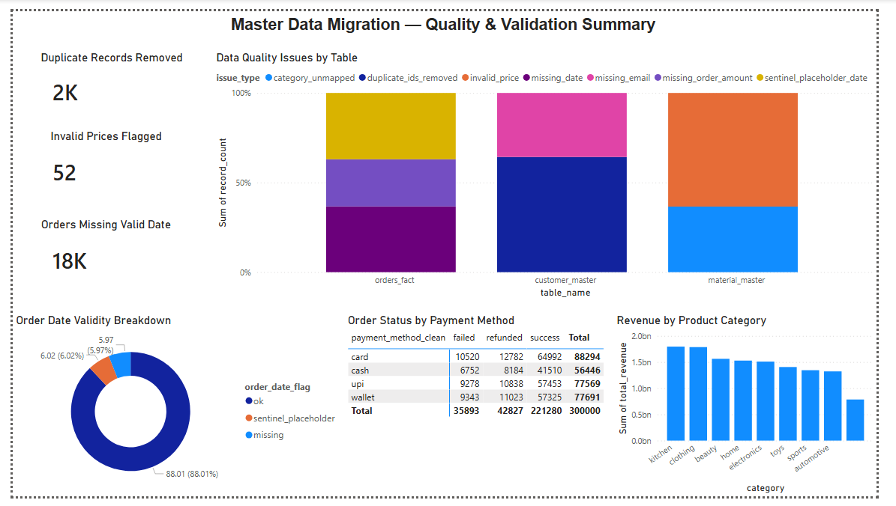

# Master Data ETL & Validation Pipeline

An end-to-end data engineering project simulating an enterprise master data
migration: raw, messy Customer Master, Material Master, and Orders data are
extracted, cleaned, validated, and loaded into Hive tables using PySpark,
with a Power BI dashboard summarizing data quality and business impact.

This project mirrors real-world master data migration work — extraction,
validation, reconciliation, and quality reporting across linked business
entities — using the same core tech stack (Python, PySpark, Hive, SQL,
Power BI).

---

## Tech Stack

- **Python 3.11**
- **PySpark 3.5** (local mode, embedded Hive metastore — no cluster or Docker required)
- **Hive** (via Spark's `enableHiveSupport()`)
- **HiveQL / Spark SQL** for validation and reconciliation queries
- **Power BI Desktop** for the quality/reporting dashboard

---

## Problem Statement

Enterprise data migrations typically involve moving large volumes of master
data (customer records, product/material catalogs, transactional history)
from legacy systems into a new environment. This data is rarely clean:
duplicate records, inconsistent formatting, missing fields, and invalid
values are the norm rather than the exception.

This project simulates that scenario using a real, intentionally "dirty"
dataset (~350K records across 3 linked tables), and builds a pipeline that:

1. Extracts raw data from each source
2. Applies validation and cleaning rules based on the *actual* issues found
   in the data (not assumed in advance)
3. Loads cleaned, validated data into Hive tables
4. Produces a data quality and reconciliation report

---

## Dataset

| Table | Rows | Role |
|---|---|---|
| `customer_master_raw.csv` | 50,000 | Customer Master |
| `material_master_raw.csv` | 500 | Material/Product Master |
| `orders_raw.csv` | 300,000 | Transactional data (for cross-referencing against master data) |

---

## Data Quality Issues Found & Resolved

Issues below were identified by directly profiling the raw data, not assumed:

| Table | Issue | Resolution |
|---|---|---|
| Customer Master | 1,800 duplicate `customer_id`s | Deduplicated, keeping first occurrence |
| Customer Master | 1,000+ missing emails | Flagged (not dropped) as a quality metric |
| Customer Master | Inconsistent name casing, mixed phone formats, multi-value `device_id(s)` field | Standardized casing, normalized phone digits, split multi-value field into count + primary device |
| Material Master | 23+ category typos (leetspeak, casing, punctuation — e.g. `3l3ctronics`, `CLOTHING`, `clo`) | Normalized via a canonical-category matcher (leetspeak translation + fuzzy prefix matching) |
| Material Master | Price field mixing commas, whitespace, negative sentinel values (`-100`), and literal `"NaN"` text | Cleaned and cast to numeric, with invalid/negative values flagged |
| Orders | Payment method (11 variants of 4 real values) and status (10 variants of 3 real values) | Normalized to canonical values |
| Orders | Date field mixing ISO dates, full timestamps, and a **sentinel placeholder (`31-12-2023`) used 18,050 times** to mark bad/missing dates | Multi-format parser with explicit sentinel detection |
| Orders | Referential integrity vs. master tables | Verified — 0 orphaned records |

### Two bugs found and fixed during development

Building this surfaced two real, non-obvious data engineering bugs — both
are good illustrations of why "the code ran without errors" isn't the same
as "the output is correct":

1. **Literal `"NaN"` text vs. floating-point NaN.** Several "missing" fields
   (price, order amount) contained the literal text `"NaN"` rather than a
   truly blank cell. Pandas silently treats that text as missing, but
   Spark's `cast("double")` parses it into a *real* IEEE floating-point
   `NaN` value — which is not SQL `null`. A naive `.isNull()` check silently
   missed these rows entirely, and downstream `SUM()`/`AVG()` aggregations
   were poisoned to `NaN` for any group containing one.

2. **Silent data loss via schema inference.** Spark's `inferSchema` looked
   at columns like `order_amount` and `price`, decided they were numeric,
   and silently converted comma-formatted values (e.g. `"1,200"`) to `null`
   **at CSV read time** — before any cleaning logic even ran, permanently
   losing recoverable data. Fixed by disabling `inferSchema` entirely and
   reading all columns as strings, applying explicit cleaning/casting
   instead of trusting automatic type inference on dirty data.

---

## Project Structure

```
master-data-etl-pipeline/
├── data/
│   ├── customer_master_raw.csv
│   ├── material_master_raw.csv
│   └── orders_raw.csv
├── scripts/
│   ├── etl_pipeline.py            # Main ETL: extract, clean, validate, load to Hive
│   ├── validation_queries.sql     # HiveQL validation & reconciliation queries
│   └── export_for_powerbi.py      # Exports query results to CSV for Power BI
├── output/                        # Generated CSVs for Power BI (created by export script)
├── dashboard/
│   └── quality_summary.pbix       # Power BI dashboard (add this file)
└── README.md
```

---

## How to Run

**Requirements:** Python 3.x, Java (JDK 8/11/17), PySpark

```bash
pip install pyspark

# 1. Run the ETL pipeline (extract, clean, validate, load to Hive)
spark-submit scripts/etl_pipeline.py

# 2. Run the validation/reconciliation queries
spark-sql --conf spark.sql.warehouse.dir=spark-warehouse -f scripts/validation_queries.sql

# 3. Export results for Power BI
spark-submit scripts/export_for_powerbi.py
```

No Docker or external Hive cluster required — `enableHiveSupport()` spins
up a local embedded Hive metastore automatically.

---

## Results Summary

| Metric | Result |
|---|---|
| Customer records processed | 50,000 → 48,200 (after dedup) |
| Duplicate records removed | 1,800 |
| Material master categories normalized | 470 / 500 (only true nulls remain unmapped) |
| Invalid/missing prices flagged | 52 |
| Orders with valid parsed dates | 264,036 / 300,000 (88%) |
| Referential integrity violations | 0 |

---

## Dashboard



Single-page Power BI summary showing data quality metrics by table, order
date validity breakdown, revenue by product category, and order status by
payment method.

---

## What This Project Demonstrates

- ETL pipeline design using PySpark's DataFrame API
- Data validation and quality-flagging patterns (not just cleaning — measuring)
- Debugging subtle, non-obvious data engineering bugs (type coercion, schema inference pitfalls)
- HiveQL for validation and reconciliation reporting
- Translating pipeline output into a business-facing Power BI summary

## Author
**Ashutosh Kumar Singh**
- LinkedIn: linkedin.com/in/ashuks
- Email: Singhashu1339@gmail.com
